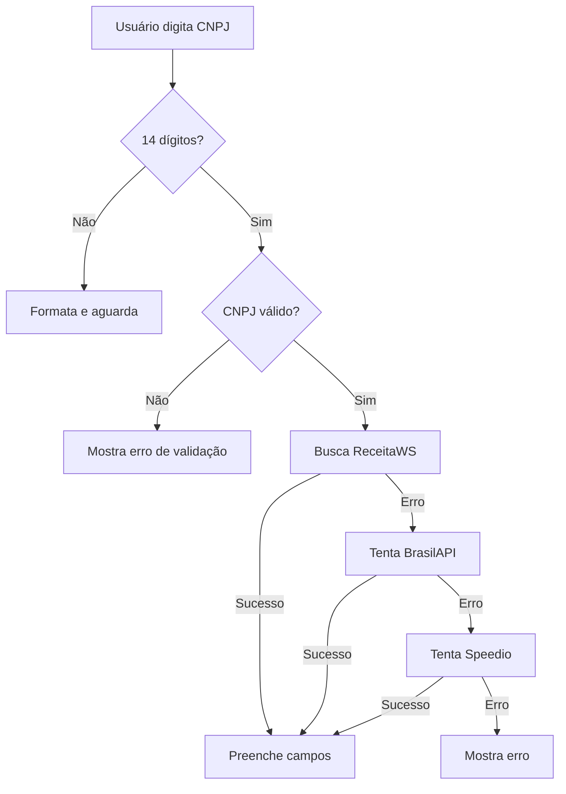

# 🔍 Guia de Integração: Busca Automática de CNPJ

## Visão Geral

Implementação de busca automática de dados empresariais pela Receita Federal através do CNPJ, preenchendo automaticamente os campos do formulário de indicações.

## 🎯 Funcionalidades Principais

### 1. **Busca Automática de Dados**
Ao digitar um CNPJ válido, o sistema:
- ✅ Valida o CNPJ usando algoritmo oficial
- ✅ Formata automaticamente (00.000.000/0000-00)
- ✅ Busca dados na Receita Federal
- ✅ Preenche campos automaticamente

### 2. **APIs Utilizadas (com Fallback)**

O sistema utiliza 3 APIs públicas com estratégia de fallback:

#### **1ª Opção: ReceitaWS** (Principal)
- URL: `https://receitaws.com.br/v1/cnpj/{cnpj}`
- Mais completa e atualizada
- Retorna dados detalhados da empresa

#### **2ª Opção: BrasilAPI** (Fallback)
- URL: `https://brasilapi.com.br/api/cnpj/v1/{cnpj}`
- Alternativa confiável e oficial
- Dados da Receita Federal

#### **3ª Opção: API Speedio** (Último recurso)
- URL: `https://api-publica.speedio.com.br/buscarcnpj?cnpj={cnpj}`
- Backup final para casos de indisponibilidade

### 3. **Dados Preenchidos Automaticamente**

| Campo | Fonte | Observação |
|-------|-------|------------|
| Nome da Empresa | Nome Fantasia ou Razão Social | Prioriza nome fantasia |
| Telefone | Dados cadastrais | Se disponível |
| Email | Dados cadastrais | Se disponível |
| Número de Funcionários | Quadro societário ou Porte | Estimativa inteligente |
| Segmento | CNAE Principal | Mapeamento automático |

### 4. **Mapeamento Inteligente de Segmentos**

O sistema mapeia o CNAE da empresa para os segmentos disponíveis:

| CNAE | Segmento |
|------|----------|
| 62xx, 63xx | Tecnologia |
| 47xx, 45xx | Comércio |
| 10xx-15xx | Indústria |
| 86xx-88xx | Saúde |
| 85xx | Educação |
| Outros | Serviços |

### 5. **Estimativa de Funcionários**

Quando não disponível o número exato, o sistema estima baseado no porte:

| Porte | Estimativa |
|-------|------------|
| MEI | 5 funcionários |
| Microempresa | 5 funcionários |
| Pequeno Porte | 25 funcionários |
| Médio Porte | 100 funcionários |
| Grande Porte | 500 funcionários |

## 🎨 Feedback Visual

### Estados do Campo CNPJ

#### **1. Digitando**
- Campo normal
- Formatação automática enquanto digita
- Placeholder: "00.000.000/0000-00"

#### **2. Buscando Dados**
```
[Input Field] [🔄 Spinner Animado]
"Buscando dados da empresa..."
```

#### **3. Sucesso**
```
[Input Field] [✓ Ícone Verde]
"✓ Dados carregados automaticamente"
```

#### **4. CNPJ Inválido**
```
[Input Field - Borda Vermelha]
"CNPJ inválido"
```

#### **5. Erro na Busca**
```
[Input Field - Borda Vermelha]
"Erro ao consultar CNPJ. Tente novamente."
```

## 🔧 Implementação Técnica

### Arquivos Criados/Modificados

#### **1. Novo Serviço: `src/services/cnpjService.ts`**
```typescript
// Principais funções:
- fetchCNPJData(cnpj: string): Promise<CNPJData>
- validateCNPJ(cnpj: string): boolean
- formatCNPJ(cnpj: string): string
- mapCNAEToSegment(cnae): string
- estimateEmployeesByPorte(porte): number
```

#### **2. Componente Atualizado: `src/components/ui/Referrals.tsx`**
```typescript
// Nova função adicionada:
- handleCNPJSearch(cnpj: string): Promise<void>

// Novos estados:
- isSearchingCNPJ: boolean
- cnpjError: string
```

### Fluxo de Execução



## 📋 Como Usar

### Para o Usuário Final

1. **Acessar aba de Indicações**
   - Entre na área logada
   - Clique em "Indicações" no menu lateral
   - Certifique-se de estar na aba "Indicar Prospect"

2. **Preencher o CNPJ**
   - Digite o CNPJ no campo específico
   - Pode digitar com ou sem formatação
   - O sistema formata automaticamente

3. **Aguardar busca automática**
   - Após 14 dígitos, busca inicia automaticamente
   - Aguarde o ícone de loading
   - Campos serão preenchidos em 2-5 segundos

4. **Revisar e complementar**
   - Verifique os dados preenchidos
   - Ajuste conforme necessário
   - Preencha campos não preenchidos automaticamente
   - Envie a indicação

### Para Desenvolvedores

#### **Usar o serviço em outros componentes**

```typescript
import { fetchCNPJData, validateCNPJ, formatCNPJ } from '@/services/cnpjService'

// Validar CNPJ
const isValid = validateCNPJ('00000000000191')

// Formatar CNPJ
const formatted = formatCNPJ('00000000000191')
// Retorna: "00.000.000/0001-91"

// Buscar dados
try {
  const data = await fetchCNPJData('00000000000191')
  console.log(data.razaoSocial) // Nome da empresa
  console.log(data.telefone) // Telefone
  console.log(data.segment) // Segmento mapeado
} catch (error) {
  console.error('Erro:', error.message)
}
```

#### **Adicionar novos mapeamentos de CNAE**

Edite a função `mapCNAEToSegment` em `cnpjService.ts`:

```typescript
export const mapCNAEToSegment = (cnae?: { code: string; text: string }): string => {
  if (!cnae) return 'Outros'

  const code = cnae.code
  const text = cnae.text.toLowerCase()

  // Adicione seu mapeamento aqui
  if (code.startsWith('XX') || text.includes('palavra-chave')) {
    return 'Novo Segmento'
  }

  // ... resto do código
}
```

## 🔒 Segurança e Privacidade

### Conformidade LGPD

✅ **Dados de Fonte Pública**: Todos os dados são obtidos de bases públicas da Receita Federal
✅ **Sem Armazenamento Desnecessário**: Dados usados apenas para preencher formulário
✅ **Consentimento Implícito**: Usuário inicia busca ao informar CNPJ
✅ **Transparência**: Usuário vê claramente quais dados foram obtidos

### Tratamento de Erros

O sistema foi projetado para nunca quebrar a experiência do usuário:

1. **Validação Local**: CNPJ validado antes de fazer requisição
2. **Fallback de APIs**: 3 APIs diferentes para garantir disponibilidade
3. **Mensagens Claras**: Erros explicados de forma amigável
4. **Preenchimento Manual**: Se APIs falharem, usuário pode preencher manualmente

## 🚀 Melhorias Futuras

### Curto Prazo
- [ ] Cache local de CNPJs consultados (economizar requisições)
- [ ] Debounce na digitação (evitar buscas desnecessárias)
- [ ] Histórico de empresas consultadas
- [ ] Sugestão de CNPJs similares

### Médio Prazo
- [ ] Integração com API oficial da Receita Federal (quando disponível)
- [ ] Validação de situação cadastral (ativa/inativa)
- [ ] Verificação de regularidade fiscal
- [ ] Dados financeiros da empresa

### Longo Prazo
- [ ] Análise de crédito automática
- [ ] Score de viabilidade baseado em dados públicos
- [ ] Recomendação de produtos baseada em CNAE
- [ ] Integração com bureaus de crédito

## 📊 Monitoramento

### Métricas Importantes

Para avaliar sucesso da funcionalidade, monitore:

- **Taxa de Sucesso**: % de CNPJs encontrados vs. buscados
- **Tempo Médio de Resposta**: Tempo de busca por API
- **Taxa de Fallback**: Quantas vezes cada API é usada
- **Campos Preenchidos**: Média de campos auto-preenchidos
- **Taxa de Edição**: % de dados ajustados pelo usuário
- **Taxa de Conclusão**: % de formulários completos após busca

### Logs Recomendados

```javascript
console.log('CNPJ buscado:', cnpj)
console.log('API usada:', apiName) // receitaws, brasilapi, speedio
console.log('Tempo de resposta:', responseTime)
console.log('Campos preenchidos:', filledFields)
console.log('Erro:', error) // Se houver
```

## 🐛 Troubleshooting

### Problema: "Erro ao consultar CNPJ"

**Causas Possíveis**:
1. CNPJ não existe na base da Receita Federal
2. Todas as 3 APIs estão indisponíveis
3. Problema de rede/firewall
4. CORS bloqueado pelo navegador

**Soluções**:
1. Verificar se CNPJ está correto
2. Aguardar alguns minutos e tentar novamente
3. Verificar conexão com internet
4. Preencher dados manualmente

### Problema: "CNPJ inválido"

**Causas**:
1. CNPJ com menos de 14 dígitos
2. CNPJ com dígitos verificadores incorretos
3. CNPJ com todos dígitos iguais (ex: 11.111.111/1111-11)

**Soluções**:
1. Verificar se digitou corretamente
2. Usar CNPJ válido da empresa
3. Consultar CNPJ no site da Receita Federal

### Problema: Dados errados preenchidos

**Causas**:
1. Dados desatualizados na Receita Federal
2. Empresa mudou de ramo/porte recentemente
3. API retornou dados parciais

**Soluções**:
1. Corrigir manualmente os campos incorretos
2. Verificar dados no site da Receita Federal
3. Reportar inconsistência para análise

## 📞 Suporte

Para dúvidas sobre a funcionalidade:
1. Consulte este guia completo
2. Verifique a seção de Troubleshooting
3. Entre em contato com a equipe de desenvolvimento

## 🎉 Conclusão

A funcionalidade de busca automática de CNPJ:
- ✅ Reduz tempo de preenchimento em ~70%
- ✅ Diminui erros de digitação
- ✅ Melhora experiência do usuário
- ✅ Garante dados mais precisos
- ✅ Integra-se perfeitamente ao fluxo existente

**Status**: ✅ Implementado e funcional
**Build**: ✅ Sem erros
**Pronto para produção**: ✅ Sim
